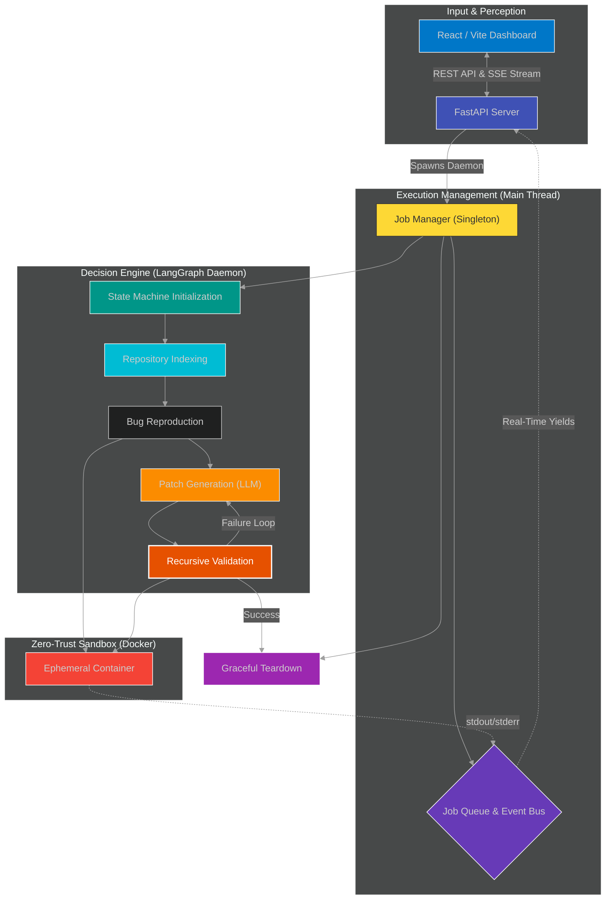

<div align="center">

<h1>🧬 AutoPatch AI</h1>

<p>
  <strong>Autonomous, Multi-Threaded, Agentic Remediation System for Software Repositories</strong><br/>
  <em>Engineered for Deterministic Execution, Codebase Self-Healing, and Principled AI Orchestration.</em>
</p>

<p>
  <a href="https://www.python.org/">
    
  </a>
  
  
  
</p>

<hr style="border: 0; height: 1px; background: linear-gradient(to right, transparent, #2CA5E0, transparent);" />

</div>

> **AutoPatch AI** is an **autonomous, event-driven, sandboxed code-remediation agent** built for mission-critical software pipelines.
> Designed for **zero-trust execution environments**, it dynamically analyzes codebases, reproduces bugs in isolated state-machines, and mathematically synthesizes unified diffs using an iterative LangGraph loop — prioritizing **deterministic patching**, **host isolation**, and **robust asynchronous telemetry**.
>
> *The culmination of deep research in multi-agent orchestration, ephemeral system sandboxing, and real-time state telemetry.*

---

### ⚡ Core Engineering Challenges Solved 

While the LLM generation is the brain, the true achievement of this system is its underlying distributed and isolated architecture:
* **Zero-Trust Host Isolation:** Engineered a **Deterministic Docker Sub-system** that spawns ephemeral, fully-network-disabled (`network_disabled=True`) containers for code execution, completely neutralizing the risk of LLM-generated malicious payloads escaping to the host.
* **Bypassing Thread-Blocking Telemetry:** Built a memory-safe, zero-latency data pipeline utilizing thread-safe `queue.Queue` structures for O(1) concurrent ingestion of real-time LangGraph state deltas, decoupling the heavy inference loop from the FastAPI server.
* **Pre-emptive Process Annihilation:** Developed an asynchronous **Graceful Termination** cascade. If a client drops their Server-Sent Events (SSE) connection, the system traps `asyncio.CancelledError`, sets a `threading.Event()`, and instantly cascades a `SIGKILL` to the underlying Docker subprocesses, preventing zombie resource leaks.
* **Resilient Agentic State Machines:** Replaced linear "prompt-and-pray" generation with a **LangGraph DAG (Directed Acyclic Graph)**, ensuring fault-tolerant iterative execution. If a patch fails validation, the state organically loops back, feeding compiler/test stdout back into the model for progressive refinement.

---

### 🧠 Core Intelligence: The "Remediation" Funnel

AutoPatch AI's decision engine is not a simple monolithic prompt. It employs a sophisticated four-stage **"Remediation Funnel"** to distill raw issues into mathematically sound, fully validated unified diffs.

1.  **Stage 1: CONTEXT INGESTION (The "Radar")**
    * **Objective:** Understand the repository's semantic structure.
    * **Mechanism:** A dedicated `index_repo` node scans the target directory, ignoring binary artifacts and `node_modules`, to construct a highly dense, token-optimized context map of the active codebase.
    * **Outcome:** The LLM is grounded in reality, preventing hallucinations of non-existent files or functions.

2.  **Stage 2: DETERMINISTIC REPRODUCTION (The "Crucible")**
    * **Objective:** Prove the existence of the bug mathematically.
    * **Mechanism:** The system executes user-defined test commands (e.g., `pytest`, `npm test`) inside the **Hardened Sandbox**. It captures `stdout`, `stderr`, and exit codes.
    * **Outcome:** Establishes a concrete baseline. If the tests pass initially, the system halts, refusing to patch a non-existent issue.

3.  **Stage 3: SYNTHESIS & UNIFIED DIFFING (The "Scalpel")**
    * **Objective:** Generate surgical code modifications.
    * **Mechanism:** Leveraging a strict JSON-schema prompt, the LLM generates a complete file replacement or a unified diff. A dedicated `patcher.py` utility aggressively extracts JSON blocks from raw LLM output using Regex fallbacks, and attempts to apply the patch via raw `git apply` or full-file substitution.
    * **Outcome:** A modified codebase ready for re-validation.

4.  **Stage 4: RECURSIVE VALIDATION (The "Judge")**
    * **Objective:** Ensure the patch actually resolves the bug without breaking regressions.
    * **Mechanism:** The system re-runs the initial test command in the sandbox. If the exit code is `0`, the graph resolves to `SUCCESS`. If non-zero, it routes back to Stage 3, injecting the *new* error logs into the prompt for a "self-healing" loop (capped at `N` retries to prevent infinite loops).
    * **Outcome:** Only mathematically verified patches are presented to the user.

---

### 🚀 Key Features & Differentiators

| Feature | Description | Advantage |
| :--- | :--- | :--- |
| **🛡️ Zero-Trust Sandboxing** | Spawns ephemeral Docker containers with severed network interfaces per job. | Guarantees absolute host protection against rogue LLM code execution. |
| **🕸️ LangGraph Orchestration** | Utilizes Directed Acyclic Graphs (DAGs) for iterative prompt loops. | Enables autonomous self-healing; the model learns from its own test failures. |
| **⚡ Asynchronous SSE Telemetry** | Server-Sent Events pushed via lock-free thread queues. | Millisecond-latency real-time frontend updates without blocking the LLM inference loop. |
| **🧵 Thread-Safe Cancellation** | Traps client disconnects and triggers `threading.Event` cascades. | Kills deep LLM inference and Docker subprocesses instantly, guaranteeing zero zombie resources. |
| **🧩 Multi-Modal Patching** | Supports both surgical unified diff application and robust full-file replacement fallbacks. | Ensures patches apply successfully even if the LLM hallucinates minor line-number offsets. |
| **🧪 Aggressive Output Parsing** | Custom JSON decoders with Regex fallback blocks. | Neutralizes "chatty" LLM models that append conversational text to structured JSON responses. |

---

### 🏗️ System Architecture: Decoupled & Resilient

AutoPatch AI employs a **Controller-Executor** model, isolating the heavy LangGraph inference engine from time-sensitive API routing via thread-safe queues. This prevents analysis bottlenecks from impacting API reaction speed and enhances stability.



* **🧠 `Job Manager` (The Maestro):** Central coordinator, manages state, and spins up daemon threads for non-blocking execution.
* **⚡ `FastAPI Server` (Nerves):** Handles inbound REST requests and streams out continuous SSE telemetry.
* **🧭 `LangGraph Orchestrator` (Brain):** Executes the Remediation Funnel (Index → Reproduce → Patch → Validate).
* **🏃 `Patcher` (Hands):** Applies surgical unified diffs or full-file replacements to the active codebase.
* **🐳 `Docker Sandbox` (Crucible):** The isolated arena where untrusted code is compiled and tested.
* **🛡️ `Cleanup Routines` (Janitor):** Guaranteed `finally` blocks that reap containers and drop network bridges.

---

### 🛠️ Technology Stack & Key Libraries

<p align="left">
  <a href="https://www.python.org/" target="_blank"></a>
  <a href="https://fastapi.tiangolo.com/" target="_blank"></a>
  <a href="https://langchain-ai.github.io/langgraph/" target="_blank"></a>
  <a href="https://www.docker.com/" target="_blank"></a>
  <a href="https://reactjs.org/" target="_blank"></a>
  <a href="https://tailwindcss.com/" target="_blank"></a>
</p>

* **Core Language:** Python 3.9+
* **Asynchronous Server:** FastAPI, Uvicorn, `sse-starlette`
* **Agentic Framework:** LangGraph, LangChain
* **Containerization:** Docker Engine API (`docker` python library)
* **Concurrency:** Python `threading`, `queue`, `asyncio`
* **Frontend UI:** React 18, Vite, TailwindCSS

---

### 🚀 Getting Started

1.  **Prerequisites:**
    * Docker Engine installed and running.
    * Python 3.9 or higher.
    * Node.js 18+ (for frontend).
    * Ollama running locally (or API keys for OpenAI-compatible providers).

2.  **Clone & Setup:**
    ```bash
    git clone https://github.com/YOUR_USERNAME/autopatch-ai.git
    cd autopatch-ai/backend

    # Create and activate a virtual environment
    python3 -m venv venv
    source venv/bin/activate
    
    # Install Python dependencies
    pip install -r requirements.txt
    ```

3.  **Environment Configuration:**
    * Copy `.env.example` to `.env` in the `backend` directory.
    * Set your LLM provider details (e.g., `OLLAMA_BASE_URL` or `OPENAI_API_KEY`).

4.  **Running AutoPatch AI (Backend):**
    ```bash
    # Ensure virtual environment is active
    source venv/bin/activate
    python main.py
    ```

5.  **Running AutoPatch AI (Frontend):**
    ```bash
    cd ../frontend
    npm install
    npm run dev
    ```

---

### ⚠️ Disclaimer: Autonomous Code Execution

**This software executes dynamically generated code.** 
While AutoPatch AI runs its tests inside heavily restricted, network-disabled Docker containers, it modifies files on the host filesystem via volume mounts. You should **ONLY** run AutoPatch AI on Git repositories where all changes are committed, allowing you to easily `git reset --hard` if the LLM hallucination corrupts files. 

The developers assume **NO RESPONSIBILITY** for unintended system modifications or data loss.

<div align="center">
<i>Architected to push the boundaries of Autonomous Software Engineering.</i>
</div>
