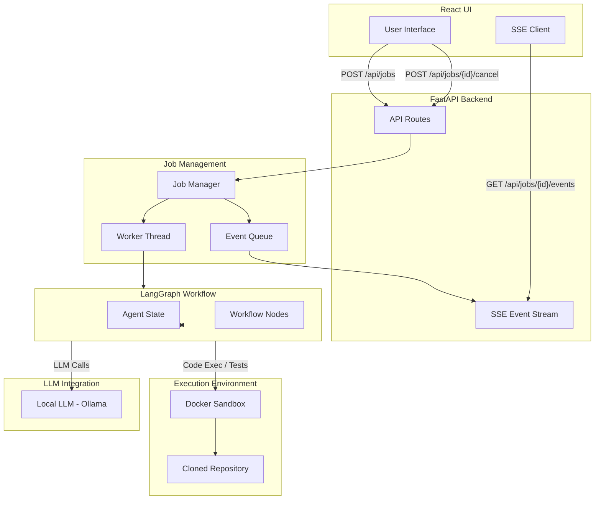

# AutoPatch AI Architecture

AutoPatch AI is an autonomous bug-resolving system designed with strict isolation, real-time observability, and a robust agentic workflow. This document outlines the core architecture of the system.

## High-Level Architecture Diagram

---

## Component Breakdown

### 1. React Frontend
The frontend is a single-page React application built with Vite and Tailwind CSS. It provides a control room interface for the user.
- **Job Form**: Captures the repository URL and the issue description.
- **SSE Client**: Uses `@microsoft/fetch-event-source` to maintain a persistent connection with the backend, receiving live updates (logs, retrieved context, generated patches, and status changes) as the agent works.
- **Safety Panel**: Displays the strict constraints applied to the Docker sandbox and provides an immediate "Abort" mechanism.

### 2. FastAPI Backend
The backend serves as the orchestration layer between the user interface and the background agentic tasks.
- **Routes**: Handles job creation, cancellation, and serves the static frontend assets.
- **SSE Streaming**: Implements an asynchronous generator that polls the `JobManager`'s event queue to push real-time telemetry to the browser.
- **Job Manager**: Maintains the state of active jobs. It spawns dedicated daemon threads for each new job to prevent blocking the asynchronous web server. It manages `threading.Event` flags to support immediate job cancellation.

### 3. LangGraph Workflow
The core intelligence of AutoPatch AI is modeled as a state machine using LangGraph. The workflow proceeds through several distinct nodes:
1. **ingest**: Validates inputs and initializes the `AgentState`.
2. **setup_sandbox**: Creates the ephemeral Docker container and custom network.
3. **index_repo**: Scans the repository to build a map of files and symbols (Repo-RAG).
4. **reproduce**: Runs the provided test command to capture the baseline error.
5. **retrieve_context**: Uses the LLM to search the repository index and pull relevant file contents based on the baseline error.
6. **generate_patch**: Instructs the LLM to write a patch fixing the issue.
7. **validate**: Applies the patch and reruns the test command inside the sandbox.
8. **report_success / report_failure**: Finalizes the state based on validation results.
9. **cleanup**: Destroys the sandbox, regardless of success, failure, or cancellation.

### 4. Sandbox Execution Environment
AutoPatch AI treats all executed code as untrusted. 
- **Ephemeral Containers**: A fresh Docker container is created for every job.
- **Airgapped**: After `pip install` completes, the container is forcibly disconnected from its custom Docker bridge network.
- **Resource Constraints**: Strict limits on Memory (256MB), CPU quotas, and PIDs (max 128) are enforced.
- **UID Mapping**: Tests run with the host user's UID to prevent permission conflicts during cleanup.

### 5. Local LLM (Ollama)
The system leverages local models via Ollama (e.g., `qwen2.5-coder:1.5b` or `7b`) to ensure absolute privacy and offline capability. The `llm.py` module handles structured JSON extraction and prompt management.
